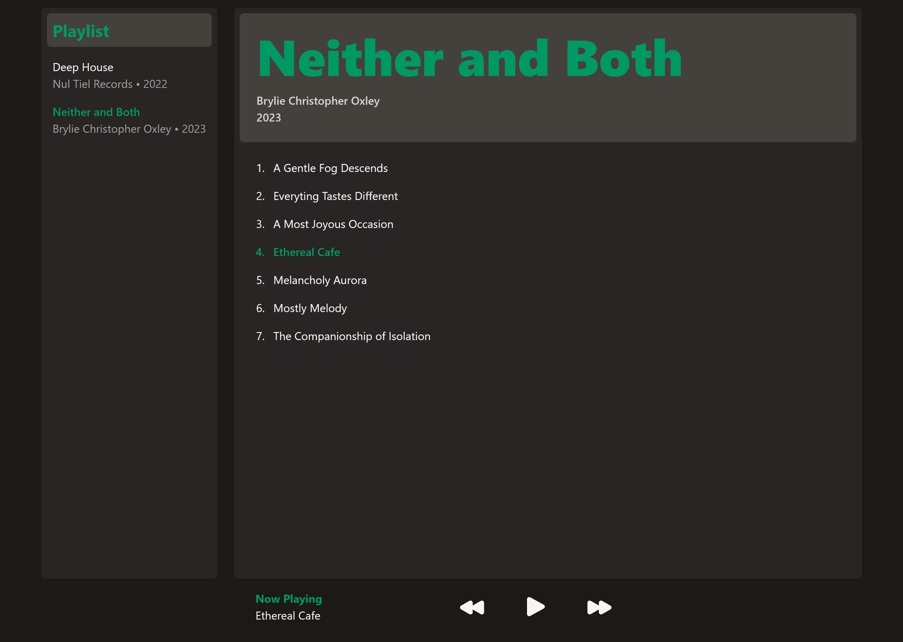

# Simple Audio Player

Live site: https://audio-player.themichaelzhu.com/

### Screenshot



I built this project as a way to learn and practice TypeScript.

### Getting started

Clone this repo.

You can use `npm` to install the dependencies and run the basic React project.

```bash
npm install
npm run dev
```

### Functionalities

- Can play through a playlist of audio files
- Display all tracks of the currently selected playlist
- Display info on the currently playing track and supporting basic functionality like play/pause, next track/previous track.

### Playlist data

The playlist data is stored in `src/data/playlists.json`. It includes a list of audio files and some associated metadata.

### Attribution

This project includes music from the following albums:

- **"Deep House"** by _Nul Tiel Records_ is licensed under [CC BY-NC-SA 4.0](https://creativecommons.org/licenses/by-nc-sa/4.0/).
- **"Neither and Both"** by _Brylie Christopher Oxley_ is licensed under [CC BY 4.0](https://creativecommons.org/licenses/by/4.0/).
